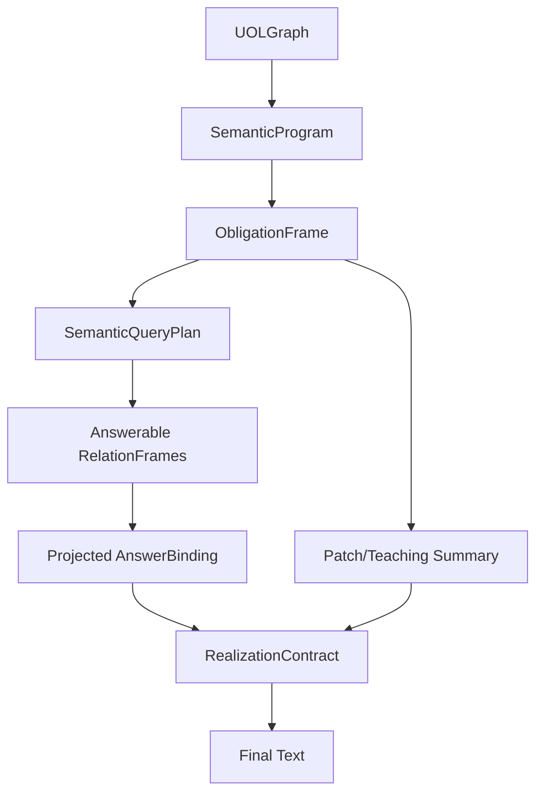

# CEMM v4.2 Exact Root Cause Trace And Gap-Fix Proposal

## Scope

This is a deeper correction to the earlier issue log. The previous diagnosis was directionally right, but this version traces the failures through the actual latest GitHub code path and separates confirmed root causes from architectural improvements.

Primary observed failures:

- `how are you` -> `I am target.`
- `What's your name` -> `I am possessor.`
- `my name is Chibueze` -> `Got it - possessor. Tell me more.`
- `what's my name?` -> `possessor`
- `lol no Chibueze` -> `Got it. I've learned that topic.`
- `bye` -> `Hello!`

## Exact Execution Path

The active CLI/web path calls:

```text
cemm/__main__.py::process_input
-> pipeline._runtime.run_text(...)
-> SemanticKernelRuntime.run_turn(...)
-> MeaningPerceptor.perceive(...)
-> MeaningGraphBuilder.build(...)
-> SemanticProgramCompiler.compile(...)
-> SemanticObligationScheduler.schedule(...)
-> TeachingFrameManager.process_turn(...)
-> RelationFrameCompiler.compile(...)
-> DurableSemanticStore.query_relations(...)
-> SemanticQueryEngine.run(...)
-> SemanticRealizer.realize(...)
-> planner / patch extraction / validation / commit
```

The important detail is that the v4.2 semantic answer is realized before the legacy planner and before patch extraction/validation/commit.

## Root Cause 1: Internal Role Atoms Are Correctly Created, Then Incorrectly Made Answerable

The role labels are not random. They are created intentionally by the perception/graph stack.

In `cemm/kernel/language_adapter.py`, pronouns map to internal roles:

```text
my   -> entity_type=user, role=possessor
your -> entity_type=self, role=possessor
you  -> entity_type=self, role=target
me   -> entity_type=user, role=target
```

In `cemm/kernel/meaning_graph_builder.py::_add_referents`, every referent also gets a role relation atom:

```text
ReferentAtom(surface="my", role="possessor")
-> UOL atom: entity/user
-> role atom: relation role:possessor, surface="possessor"
-> edge: user has_role possessor
```

That part is architecturally legitimate. The bug starts later.

In `cemm/kernel/relation_frame_compiler.py`, `has_role` is compiled into a normal executable relation frame:

```text
_EDGE_TYPE_TO_FAMILY["has_role"] = "role"
_EDGE_TYPE_TO_KEY["has_role"] = "has_role"
_INVERSE_HINTS["has_role"] = ["role_of"]
```

Then `_compile_edge()` makes the role atom the `object`:

```text
subject = source atom
object = target atom
relation_key = has_role
object.surface = "target" | "possessor" | "topic"
```

Confirmed consequence:

```text
internal binding edge: self/you --has_role--> target
becomes answerable relation frame:
subject=self/you, relation_key=has_role, object.surface=target
```

The system has crossed the boundary between graph machinery and user/world facts.

## Root Cause 2: The Query Engine Selects Role Frames As The Query Relation

In `cemm/kernel/semantic_query_engine.py::build_query`, the entry instruction is matched against relation frames by shared source atom ids:

```text
matching_frames = [
    f for f in relation_frames
    if self._frame_matches_entry(f, entry)
]
```

`_frame_matches_entry()` returns true if any instruction atom id appears in `frame.source_atom_ids`.

Because role frames are created from the same group atoms, they often match the entry instruction.

Then the highest-confidence matching frame supplies the query relation:

```text
best = max(matching_frames, key=lambda f: f.confidence)
relation_key = best.relation_key
subject_constraint = best.subject...
object_constraint = best.object...
```

For pronouns, role frames often have high confidence around `0.9`, higher than surface-teaching relation frames around `0.72-0.74`. So `has_role` wins.

If nothing matches, the engine has an even worse fallback:

```text
if not relation_key and relation_frames:
    relation_key = relation_frames[0].relation_key
```

That means an unresolved semantic query borrows the first relation in the graph instead of becoming unresolved.

## Root Cause 3: The Query Engine Always Projects `frame.object` As The Answer

In `SemanticQueryEngine.execute()`, every returned relation frame becomes:

```text
SlotFill(
    slot_name="object",
    concept_id=frame.object.concept_id,
    entity_id=frame.object.entity_id,
    surface=frame.object.surface,
    relation_key=frame.relation_key,
)
```

There is no projection policy.

So if the selected frame is:

```text
self/you --has_role--> target
```

the answer slot becomes:

```text
answer = "target"
```

If the selected frame is:

```text
user/my --has_role--> possessor
```

the answer slot becomes:

```text
answer = "possessor"
```

This exactly explains:

```text
how are you       -> I am target.
What's your name  -> I am possessor.
what's my name?   -> possessor
```

## Root Cause 4: The Scheduler Has The Right Obligation Names But Does Not Reach Them

`cemm/types/obligation_frame.py` already defines useful obligations:

```text
answer_self_model
answer_user_profile
answer_relation
exit
```

But `cemm/kernel/semantic_obligation_scheduler.py` maps every generic question to:

```text
question -> answer_concept
```

It only refines to `answer_self_model` when `_targets_self()` sees a self atom or self-ish output slot.

It does not refine:

```text
"what's my name?" -> answer_user_profile
"what can you do?" -> answer_self_model / answer_capability
"what does that mean?" -> repair / relation-definition clarification
"who/what is X?" -> answer_relation or answer_concept_definition
```

So `what's my name?` remains `answer_concept`, even though the architecture already has `answer_user_profile`.

## Root Cause 5: `session_exit` Is Collapsed Into `social`, And Non-Lookup Obligations Still Query

In `cemm/kernel/semantic_program_compiler.py`, the compiler maps:

```text
session_exit -> social
```

There is no `exit` instruction kind in `cemm/types/semantic_program.py::INSTRUCTION_KINDS`.

Then the scheduler maps:

```text
social -> social_reply
```

The query engine says `social_reply` has query kind `none`, but `execute()` does not stop when `query_kind == "none"`. It only checks whether `relation_key` and algebra exist.

Because `build_query()` can still select a relation frame for a social instruction, `binding.has_answer` becomes true. Then `_template_for_obligation()` returns:

```text
social_reply -> social_response
```

And `SemanticRealizer` has:

```text
social_response = "Hello!"
```

This exactly explains:

```text
bye -> Hello!
```

The deeper issue is not just the greeting template. The runtime is running an answer query for an obligation that should not need an answer binding at all.

## Root Cause 6: Realizer Slot Validation Is Bypassed By Fallback

`cemm/kernel/semantic_realizer.py` claims slot kind validation prevents wrong values, but then it has this fallback:

```text
if binding and binding.slot_fills and "answer" not in variables:
    best = max(binding.slot_fills, key=lambda f: f.confidence)
    variables["answer"] = best.surface or best.concept_id or best.entity_id
```

That fallback does not validate slot kind compatibility.

So even if the realization contract rejects a bad slot, the raw binding surface can still be emitted.

This keeps role labels alive at the final output boundary.

## Root Cause 7: Teaching Acknowledgement Is A Query Result, Not A Patch Summary

For teaching, the scheduler maps:

```text
teaching -> continue_teaching
```

`SemanticQueryEngine._query_kind_for_obligation()` maps:

```text
continue_teaching -> lookup
```

So the teaching acknowledgement is generated through the same relation-frame query path that is leaking `possessor`.

`SemanticRealizer` then uses:

```text
teaching_continuation = "Got it - {answer}. Tell me more."
```

Because `answer` is coming from a `has_role` frame, the result is:

```text
my name is Chibueze -> Got it - possessor. Tell me more.
```

A teaching acknowledgement should come from the teaching frame or graph patch candidate summary, not from a general lookup query.

## Root Cause 8: The Durable Learning Path Is Broken By Patch Schema Mismatch

Even if realization were fixed, learned facts still would not reliably become queryable durable relations.

In `cemm/kernel/meaning_graph_builder.py::_extract_graph_patches`, teaching relation operations are emitted like this:

```text
operation = upsert_relation_candidate
fields = {
    "relation": edge.edge_type,
    "source_concept_key": source.key,
    "target_concept_key": target.key,
    "group_id": group.id,
}
```

But `cemm/memory/durable_semantic_store.py::apply_validated_patch` reads:

```text
relation_key = op.fields.get("relation_key", "")
subject_concept_id = op.fields.get("subject_concept_id", "")
subject_entity_id = op.fields.get("subject_entity_id", "")
subject_surface = op.fields.get("subject_surface", "")
object_concept_id = op.fields.get("object_concept_id", "")
object_entity_id = op.fields.get("object_entity_id", "")
object_surface = op.fields.get("object_surface", "")
```

Those names do not match.

So an accepted teaching patch would produce an empty or badly formed durable relation:

```text
relation_key = ""
subject = ""
object = ""
```

Concept patches have the same mismatch:

```text
builder emits: fields["key"]
store reads:   fields["concept_key"]
```

This is a hard schema contract break between patch extraction and patch commit.

## Root Cause 9: The Validator Rejects Teaching Patches Because Evidence Refs Are Missing

`PatchValidator.validate()` requires:

```text
source_refs present
evidence_refs present
permission valid
...
```

But the teaching graph patch built by `_extract_graph_patches()` includes:

```text
source_refs = ...
permission_refs = ...
```

and does not populate:

```text
evidence_refs
```

That fails `evidence_present`.

Because any failed check prevents `status == "accepted"`, `PatchCommitter.commit()` will not write it:

```text
if not validation.accepted:
    return rejected/quarantined
```

So the system can say it learned something before the patch path has accepted or committed the learned relation.

## Root Cause 10: The Active Runtime Bypasses Pipeline Self-State Injection

`cemm/kernel/pipeline.py::run()` injects self state:

```text
self_state = self._store.self_store.latest()
kernel.self_view = SelfView.from_self_state(...)
```

But `cemm/__main__.py::process_input()` does not call `Pipeline.run()`. It calls:

```text
cycle = pipeline._runtime.run_text(text, context_id=context_id)
```

`SemanticKernelRuntime.run_text()` builds its own kernel from `ContextKernelBuilder()` and does not receive the seeded `store.self_store` self model.

Therefore the active CLI/web path cannot reliably answer `What's your name?` from the seeded self-state, even though `seed_self_state()` populated the store.

The role-label leak masks this by returning `possessor`, but the self-model path is also disconnected.

## Failure Trace By Utterance

### `how are you` -> `I am target.`

Confirmed chain:

```text
tokens: how are you
MeaningPerceptor:
  group_type = question
  intent_key = question
  target_role = self, because token_set contains "you"
EnglishLanguageAdapter:
  you -> ReferentAtom(entity_type=self, role=target)
MeaningGraphBuilder:
  creates role atom surface="target"
  adds has_role edge: self/you -> target
SemanticProgramCompiler:
  instruction_kind = question
SemanticObligationScheduler:
  _targets_self() true
  obligation_kind = answer_self_model
RelationFrameCompiler:
  compiles has_role into relation frame
SemanticQueryEngine:
  selects matching has_role frame
  projects frame.object.surface = "target"
SemanticRealizer:
  self_identity template -> "I am target."
```

### `What's your name` -> `I am possessor.`

Confirmed chain:

```text
your -> ReferentAtom(entity_type=self, role=possessor)
role atom surface="possessor"
has_role frame selected
answer_self_model projects object.surface
self_identity template -> "I am possessor."
```

### `my name is Chibueze` -> `Got it - possessor. Tell me more.`

Confirmed chain:

```text
my -> ReferentAtom(entity_type=user, role=possessor)
group has "is" and is not a question -> teaching
surface teaching relation also exists: "my name" is_a "chibueze"
but role frame confidence is higher than teaching relation confidence
SemanticQueryEngine selects has_role
continue_teaching uses lookup result
teaching_continuation -> "Got it - possessor. Tell me more."
```

### `what's my name?` -> `possessor`

Confirmed chain:

```text
my -> user possessor
question remains answer_concept, not answer_user_profile
query selects has_role frame
evidence_answer template prints raw answer
answer = possessor
```

### `lol no Chibueze` -> `Got it. I've learned that topic.`

Confirmed chain:

```text
Chibueze -> capitalized referent role=topic
statement/assertion -> store_patch
store_patch still runs query
query selects has_role/topic frame
store_confirmation -> "Got it. I've learned that topic."
```

### `bye` -> `Hello!`

Confirmed chain:

```text
bye -> intent_key=session_exit
SemanticProgramCompiler maps session_exit -> social
SemanticObligationScheduler maps social -> social_reply
SemanticQueryEngine still runs relation query for query_kind=none
binding.has_answer becomes true due role frames
template social_response -> "Hello!"
```

## The Actual Architectural Gap

The system has the right broad pieces:

- UOL graph
- role/port binding
- semantic program
- obligation frame
- relation frames
- relation algebra
- answer binding
- realization contract
- graph patches
- validation/commit path

But it lacks a typed bus contract between them.

Right now this happens:

```text
all graph edges
-> all relation frames
-> any relation frame can satisfy any query
-> frame.object becomes answer
-> answer string is realized
```

The runtime needs this instead:

```text
graph role/port structure
-> semantic instruction
-> typed obligation
-> typed query plan
-> answerable relation frames only
-> projection policy
-> typed answer binding
-> realization contract
-> final text
```

## Gap-Fix Proposal

### 1. Add RelationFrame Execution Metadata

Extend `RelationFrame` with execution metadata:

```python
@dataclass
class RelationFrame:
    ...
    answerable: bool = True
    structural: bool = False
    projection_policy: str = "object"
    query_tags: list[str] = field(default_factory=list)
```

Compile frame policies as:

| Relation source | relation_family | structural | answerable | projection_policy |
|---|---:|---:|---:|---|
| `has_role` role/port binding | `role` | true | false | `none` |
| `asks_about` if later compiled | `query` | true | false | `none` |
| `teaches` | `teaching` | true | false | `none` |
| `is_a` from teaching | `taxonomy` | false | true | `object` |
| `same_as` from teaching | `identity` | false | true | `object` |
| `has_property` | `property` | false | true | `object` |
| durable user profile relation | `profile` | false | true | `profile_value` |
| durable self model relation | `self_model` | false | true | `self_value` |

Do not delete `has_role`; it is essential CPU wiring. Just prevent it from satisfying ordinary user answer obligations.

### 2. Replace Relation Selection With A QueryPlan Compiler

Do not let `SemanticQueryEngine.build_query()` choose a relation by highest-confidence frame overlap.

Add a small query planner before execution:

```text
ObligationFrame + SemanticInstruction + UOLGraph + WorkingSet
-> SemanticQueryPlan
```

`SemanticQueryPlan` should contain:

```python
query_kind: lookup | assert | none | clarify
target_domain: self_model | user_profile | concept | relation | capability | social | teaching | memory_write
relation_key: str
subject: QueryConstraint
object: QueryConstraint
projection_policy: str
allowed_relation_families: set[str]
allow_structural_frames: bool = False
unresolved_reasons: list[str]
```

Then `SemanticQueryEngine.execute()` should only execute if:

```text
query_kind == lookup
relation_key is not empty
projection_policy != none
```

If the planner cannot derive these, return:

```text
has_answer = false
abstention_reason = missing_query_plan
```

Never default to `relation_frames[0]`.

### 3. Make Non-Lookup Obligations Skip Query Execution

For obligations like:

```text
social_reply
exit
continue_teaching
store_patch
ask_clarification
repair
```

the response source should not be a generic relation lookup unless the obligation explicitly requests one.

Implement:

```text
if query_kind == "none":
    return empty AnswerBinding with abstention_reason=""
```

Then `_template_for_obligation()` must allow non-answer templates before checking `binding.has_answer`:

```text
exit -> session_exit
social_reply -> social_response
store_patch -> store_confirmation_from_patch
continue_teaching -> teaching_continuation_from_frame
```

### 4. Repair Compiler And Scheduler Obligation Typing

Add `exit` to `INSTRUCTION_KINDS`.

Change:

```text
session_exit -> social
```

to:

```text
session_exit -> exit
```

Then scheduler mapping:

```text
exit -> exit
```

Add obligation refiners:

```text
what's my name?      -> answer_user_profile(property=name)
what's your name?    -> answer_self_model(property=name)
how are you?         -> answer_self_model(property=state/status) or social_checkin_reply
what can you do?     -> answer_self_model(property=capabilities)
what does that mean? -> repair / clarify_prior_output
who/what is X?       -> answer_concept_definition or answer_relation
```

This should be driven by role/slot structure, not phrase hardcoding:

- possessor role + user entity + property candidate `name` -> user profile query
- possessor role + self entity + property candidate `name` -> self model query
- target self + state/status predicate -> social/self-state query
- capability intent -> self affordance query

### 5. Add A Profile/Self Property Extractor

The graph currently turns `my` into `possessor`, but does not reliably convert:

```text
my name is Chibueze
```

into:

```text
user --profile:name--> Chibueze
```

Add a graph-level operator:

```text
PossessivePropertyRelationExtractor
```

Input pattern:

```text
possessor entity/user or self
property surface/name
copular/equality relation
value entity/surface
```

Output relation frame and patch candidate:

```text
relation_key = profile:name
relation_family = profile
subject_entity_id = user
object_surface = Chibueze Opata
projection_policy = profile_value
answerable = true
```

This is not hardcoding names as a response. It is a structural possessive-property operator.

### 6. Fix Patch Operation Schema

Define one canonical schema for `upsert_relation_candidate`.

Recommended fields:

```python
{
    "relation_key": "profile:name" | "is_a" | "same_as" | ...,
    "relation_family": "profile" | "taxonomy" | "identity" | ...,
    "subject_concept_id": "...",
    "subject_entity_id": "...",
    "subject_surface": "...",
    "object_concept_id": "...",
    "object_entity_id": "...",
    "object_surface": "...",
    "source_atom_ids": [...],
    "evidence_refs": [...],
    "inverse_keys": [...]
}
```

Update `MeaningGraphBuilder._extract_graph_patches()` to emit this schema.

Also fix concept patch fields:

```text
concept_key, surface, definition, parent_keys
```

instead of `key` when the durable store expects `concept_key`.

### 7. Populate Patch Evidence Refs

Every graph patch should carry evidence refs from the atoms/edges that produced it.

For teaching relation patches:

```text
patch.evidence_refs = union(source.evidence, relation.evidence, target.evidence, edge.evidence)
```

If evidence refs cannot be found, the patch should be explicitly non-committable and the UI should not say "I've learned".

### 8. Realize Store Confirmations From Commit Result Or Patch Candidate, Not Query Binding

`store_confirmation` must not use `answer`.

Use:

```text
validation accepted + commit created records:
  "Got it. I've learned that your name is Chibueze."

validation needs confirmation:
  "I can remember that, but I need confirmation."

validation rejected/quarantined:
  "I heard that, but I could not store it safely."
```

For teaching continuation:

```text
TeachingFrame.target_concept_key
open_slots
latest accepted/possible patch summary
```

Do not query arbitrary relation frames to fill teaching acknowledgement text.

### 9. Make The Realizer Contract-Strict

Remove this fallback:

```text
binding.slot_fills -> variables["answer"]
```

or make it pass the same slot kind and projection checks as contract slots.

Also narrow template slot kinds:

```text
evidence_answer should not accept arbitrary surface
teaching_continuation should not accept arbitrary surface
store_confirmation should not accept arbitrary surface
```

Introduce slot kinds:

```text
profile_value
self_value
concept_definition
relation_filler
patch_summary
clarification_target
```

### 10. Reconnect Self Model To The Active Runtime Path

Because `process_input()` uses `pipeline._runtime.run_text()`, runtime-created kernels do not receive `store.self_store.latest()`.

Options:

1. Make `Pipeline.run()` the only application entrypoint again.
2. Or pass store/self-view providers into `SemanticKernelRuntime`.
3. Or make `run_text()` accept a prebuilt kernel from `Pipeline`.

Do not keep two session/kernel construction paths.

### 11. Make DurableSemanticStore Actually Durable Or Rename It

`SemanticKernelRuntime.__init__()` constructs:

```text
self._durable_semantic_store = DurableSemanticStore()
```

That store is in-memory only.

If it is intended as the active v4.2 store, back it with `PersistentLatticeStore` or `Store`.

If it is temporary, rename or document it as:

```text
WorkingSemanticStore
```

The architecture should not claim durable semantic learning if accepted patches only live inside one runtime object.

## Minimal Corrected Runtime Contract

The corrected hot path should be:



The critical invariant:

```text
structural frames may guide planning,
but only answerable frames with a valid projection policy may fill user-facing slots.
```

## Tests To Add First

### Unit Tests

1. `test_relation_frame_compiler_marks_has_role_structural_not_answerable`
2. `test_query_engine_never_defaults_to_first_relation_frame`
3. `test_query_engine_skips_query_kind_none`
4. `test_answer_binding_uses_projection_policy`
5. `test_realizer_rejects_invalid_fallback_slot`
6. `test_session_exit_compiles_to_exit_obligation`
7. `test_teaching_patch_schema_matches_durable_store`
8. `test_teaching_patch_contains_evidence_refs`
9. `test_accepted_name_patch_creates_profile_name_relation`
10. `test_runtime_run_text_has_self_view_or_uses_pipeline_run`

### Golden Trace

```text
User: how are you
Expected: social/self-state answer, not target

User: What's your name
Expected: CEMM or explicit missing self-name, not possessor

User: my name is Chibueze Opata
Expected: stores profile:name patch or reports validation status

User: what's my name?
Expected: Chibueze Opata

User: lol no Chibueze
Expected: repair/correction handling, not "learned topic"

User: bye
Expected: closing response, not Hello
```

### Structural Invariants

```text
No answer binding may use a frame where answerable=false.
No realization may emit a naked role label: target, possessor, topic, actor, holder.
No store confirmation may be emitted before validation/commit status is known.
No query may execute with relation_key derived only from relation_frames[0].
No query_kind=none obligation may require answer binding.
No upsert_relation_candidate may reach the committer with missing relation_key and missing subject/object.
```

## Implementation Order

1. Add `answerable`, `structural`, and `projection_policy` to `RelationFrame`.
2. Mark `has_role` frames structural/non-answerable.
3. Make `SemanticQueryEngine` refuse structural frames and remove first-frame fallback.
4. Make query execution respect `query_kind == "none"`.
5. Fix `session_exit -> exit`.
6. Add obligation refiners for self/profile/capability/repair questions.
7. Fix realization fallback and slot kinds.
8. Fix graph patch field schema and evidence refs.
9. Realize teaching/store confirmations from patch validation/commit summaries.
10. Reconnect active runtime to self state and persistent semantic memory.
11. Add the golden trace tests and structural invariant tests.

## Bottom Line

The exact failure is not that CEMM lacks semantic graph machinery. It has the machinery, but the v4.2 integration lets internal operator/port structures ride the same bus as answerable world knowledge.

The fix is to introduce typed execution discipline:

```text
role frames are for binding
relation frames are for reasoning
query plans choose answerable frames
projection policies fill typed slots
realization contracts emit only validated slot kinds
durable learning writes only accepted graph patches with matching schemas
```

That preserves the architecture and removes the role-label collapse without turning the system into a pile of phrase patches.
