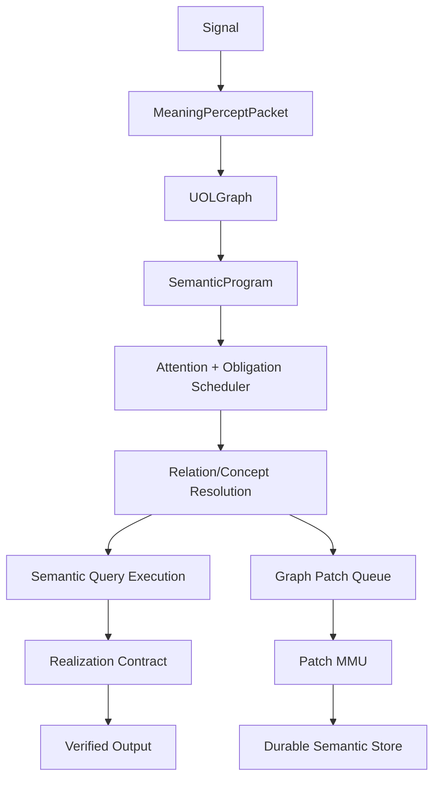

# Semantic Graph Brain Gap-Fix Implementation Plan

Status: architectural gap-fix implementation plan  
Audience: CEMM maintainers, ML/NLP engineers, runtime implementers  
Scope: v4.2 semantic kernel/runtime gap closure  
Repository reviewed: `robosys-labs/cemm` on GitHub `main`

## 0. Executive Thesis

CEMM does not need a larger set of phrase patches. It needs the current
v4.2 pieces to become a real semantic machine:

```text
perception bus -> UOL instruction graph -> attention scheduler
-> resolution/execution units -> memory MMU -> durable semantic store
-> realization bus
```

The repository already contains much of the right foundation:

- canonical UOL atoms and edges
- `MeaningPerceptPacket`
- `UOLGraph`
- candidate sets
- construction matches
- concept lattice
- port resolver
- affordance predictor
- graph patch types
- patch validator
- concept consolidator
- semantic attention controller
- runtime-cycle result type

The serious remaining gap is that these pieces are not yet bound by a single
kernel contract. They exist, but the active runtime still allows multiple
authorities to interpret, retrieve, decide, write memory, and realize text.

The fix is to turn the architecture from "modules with good names" into a
runtime with hard semantic invariants.

## 1. What Went Wrong In The Trace

The trace is not primarily about the specific words "name", "president",
"leader", or "United States". Those are only probes. The real failure is that
the runtime has no enforced semantic bus discipline.

Observed behavior:

```text
"what's your name?" -> repair/social answer
"do you remember my name?" -> "Your name is good."
"Do you know what a president is?" -> capability summary
teaching continuation -> abstain
role query after teaching -> acknowledgment or abstain
"go away" -> abstain
```

These are not independent defects. They are all manifestations of the same
kernel-level weaknesses:

1. Discourse wrappers can outrank semantic obligations.
2. A teaching state is not compiled into a persistent concept-building frame.
3. Claims are written as flat facts before becoming operational relation
   structures.
4. Retrieval queries search stored rows more than semantic roles.
5. Realization receives selected claim IDs but not typed slot lineage.
6. Patch validation exists but is not yet the mandatory memory protection unit.
7. `SemanticKernelRuntime` exists but is not the single executor of the turn.

The right fix is not:

```text
if text contains "president" then ...
if text contains "your name" then ...
if text contains "leader of the united states" then ...
```

The right fix is:

```text
every turn compiles into a typed UOL program;
every UOL program produces typed obligations;
every obligation binds typed slots;
every answer is realized from bound slots;
every durable write is an accepted graph patch;
every learned relation becomes queryable through relation algebra.
```

## 2. CPU/Brain Analogy

CEMM should behave like a high-level semantic CPU.

| CPU Concept | CEMM Equivalent |
|---|---|
| instruction stream | `MeaningPerceptPacket.meaning_groups` |
| instruction IR | `UOLGraph` |
| registers | active atoms, ports, focus items, selected paths |
| program counter | active discourse group and obligation pointer |
| branch predictor | candidate-set resolver and interpretation path selector |
| execution units | concept resolver, construction matcher, port resolver, relation executor, affordance predictor |
| cache | semantic working set |
| MMU | patch validator and permission/source/freshness policy |
| write buffer | graph patch queue |
| main memory | concept/construction/predicate/affordance/source-policy stores |
| output bus | realization contract |
| exception path | ask, abstain, retrieve, quarantine, repair |

The current implementation has many components, but the bus discipline is weak:
old pipeline stages can bypass the CPU, and old operators can write memory as
if there were no MMU.

## 3. Non-Drift Principle

Every implementation step must satisfy this rule:

```text
Fix the class of failure, not the example sentence.
```

Concrete translation:

- Do not add `president`-specific code.
- Do not add `Obama`-specific code.
- Do not add `United States`-specific code.
- Do not add a one-off "what's your name" answer path.
- Do not add more fallback strings to hide semantic failure.

Instead:

- add role-relation compilation
- add teaching-session graph state
- add relation inversion
- add slot lineage
- add semantic obligation ordering
- add query-frame compilation
- add graph-patch-only memory commit
- add invariant tests that prevent bypasses

## 4. Target Runtime Contract

The kernel must enforce one turn cycle:

```text
Signal
-> MeaningPerceptor
-> MeaningPerceptPacket
-> MeaningGraphBuilder
-> UOLGraph
-> SemanticAttentionController
-> RuntimeResolution
-> RetrievalPlan/Execution
-> ActResolutionPlan
-> RealizationContract
-> GraphPatchQueue
-> PatchValidator
-> PatchCommitter
-> DurableSemanticStore
```

No stage may write durable truth before the patch validator.

No stage may realize user-facing text without a realization contract.

No stage may select a response obligation from raw text when the UOL graph has
an unresolved or stronger semantic obligation.

## 5. Core Gap: Missing Runtime IR Boundaries

The repo has `UOLGraph`, but the runtime still passes many compatibility
objects:

- `ConversationActPacket`
- `GroundedGraph`
- `MemoryPacket`
- `InferencePacket`
- `DecisionPacket`
- `SemanticAnswerGraph`
- old observation semantics
- old store claims

These are not all bad. The problem is authority. Some are still decision
authorities instead of views derived from the UOL runtime.

### Gap-Fix Rule

Introduce three explicit IR boundaries:

1. `SemanticProgram`
2. `RuntimeResolution`
3. `RealizationContract`

These should not replace `UOLGraph`; they should wrap and specialize it.

## 6. New Type: SemanticProgram

Add:

```text
cemm/types/semantic_program.py
```

Purpose:

`SemanticProgram` is the executable view of one turn's UOL graph. It groups
meaning groups into executable semantic instructions.

Fields:

```python
@dataclass
class SemanticInstruction:
    instruction_id: str
    group_id: str
    surface: str
    instruction_kind: str
    atom_ids: list[str]
    edge_ids: list[str]
    candidate_set_ids: list[str]
    construction_match_ids: list[str]
    predicate_ids: list[str]
    input_slots: dict[str, str]
    output_slots: dict[str, str]
    discourse_parent_id: str = ""
    discourse_relation: str = ""
    confidence: float = 0.5

@dataclass
class SemanticProgram:
    graph_id: str
    signal_id: str
    context_id: str
    instructions: list[SemanticInstruction]
    entry_instruction_id: str
    discourse_edges: list[str]
    candidate_sets: list[str]
    diagnostics: dict[str, Any]
```

Instruction kinds are not new atom primitives. They are runtime execution
classes:

- `social`
- `question`
- `teaching`
- `assertion`
- `correction`
- `command`
- `repair`
- `safety`
- `creative`
- `unknown`

These are compiled from canonical atoms, edges, groups, construction matches,
and candidate sets.

## 7. New Module: SemanticProgramCompiler

Add:

```text
cemm/kernel/semantic_program_compiler.py
```

Inputs:

```text
UOLGraph
MeaningPerceptPacket
ContextKernel
```

Outputs:

```text
SemanticProgram
```

Responsibilities:

1. Convert each `UOLMeaningGroup` into a `SemanticInstruction`.
2. Preserve discourse parent/child links.
3. Classify instruction kind from graph structure, not surface phrases.
4. Attach candidate-set IDs without collapsing them.
5. Attach construction match IDs.
6. Determine the entry instruction by semantic obligation ranking.

The compiler must rank obligations by semantic force:

```text
safety
-> direct content question
-> correction/repair
-> active teaching continuation
-> assertion/definition teaching
-> command
-> social wrapper
-> acknowledgment
-> unknown
```

This ranking is not a hardcoded phrase patch. It is a runtime scheduling rule
over instruction classes and discourse structure.

Acceptance tests:

- A social prefix cannot be the entry instruction when a child question exists.
- A playful marker cannot be the entry instruction when a question instruction
  exists.
- A teaching continuation must attach to active teaching state.
- Rejected entry candidates remain in diagnostics.

## 8. Core Gap: Missing Semantic Obligation Scheduler

The current `ActResolutionPlanner` creates obligations, but it is still
influenced by `ConversationActPacket` and flat priorities.

The runtime needs an obligation scheduler over `SemanticProgram`.

## 9. New Module: SemanticObligationScheduler

Add:

```text
cemm/kernel/semantic_obligation_scheduler.py
```

Inputs:

```text
SemanticProgram
SemanticWorkingSet
ContextKernel
```

Output:

```text
ObligationFrame
```

Suggested type:

```python
@dataclass
class ObligationFrame:
    primary_instruction_id: str
    obligation_kind: str
    response_mode: str
    evidence_policy: str
    write_policy: str
    required_slots: list[str]
    blocked_by: list[str]
    child_obligations: list[str]
    suppressed_obligations: list[dict[str, Any]]
    confidence: float
```

Obligation kinds:

- `answer_concept`
- `answer_relation`
- `answer_self_model`
- `answer_user_profile`
- `continue_teaching`
- `store_patch`
- `ask_clarification`
- `abstain_policy`
- `repair`
- `social_reply`
- `exit`

Important distinction:

`response_mode` is not authority. It is only an output strategy. The authority
is `obligation_kind`.

Acceptance tests:

- `lol, what's your name?` schedules `answer_self_model`, suppresses
  `social_reply`.
- `ok great, so who's the leader of X?` schedules `answer_relation`, suppresses
  `acknowledgment`.
- `and the leader ...` inside teaching mode schedules `continue_teaching`.

## 10. Core Gap: Teaching Is Not A Runtime State Machine

The trace shows the user explicitly enters teaching mode, then subsequent
content is misrouted.

Teaching is not just a conversation act. It is a graph-building state.

## 11. New Type: TeachingFrame

Add:

```text
cemm/types/teaching_frame.py
```

Fields:

```python
@dataclass
class TeachingFrame:
    frame_id: str
    context_id: str
    target_concept_key: str
    target_concept_id: str = ""
    active: bool = True
    started_signal_id: str = ""
    last_signal_id: str = ""
    open_slots: list[str] = field(default_factory=list)
    accumulated_graph_ids: list[str] = field(default_factory=list)
    accumulated_patch_ids: list[str] = field(default_factory=list)
    current_definition_graph_id: str = ""
    confidence: float = 0.5
```

Add to session state:

```text
kernel.conversation.active_teaching_frame
```

or a separate `TeachingStateStore` if modifying `ContextKernel` is too broad.

## 12. New Module: TeachingFrameManager

Add:

```text
cemm/kernel/teaching_frame_manager.py
```

Responsibilities:

1. Open a teaching frame when a teaching instruction targets a concept.
2. Continue it across turns while discourse cues indicate continuation.
3. Attach incomplete clauses to the target concept.
4. Close or decay the frame after topic shift, explicit completion, or timeout.
5. Produce graph patches only through patch candidates.

This must use graph evidence:

- teaching intent atom
- target concept/entity atom
- discourse relation edge
- source/evidence atom
- active topic state
- candidate-set confidence

It must not be implemented as:

```text
if text starts with "and" then append to previous concept
```

The connective can be evidence, but the state transition belongs to
`TeachingFrameManager`.

Acceptance tests:

- "I want to teach you about X" opens a teaching frame for X.
- "X is Y" adds definition relation to X.
- "and Y does Z" attaches inherited affordance/relation to the frame.
- A normal unrelated question closes or suspends the teaching frame.
- All produced memory writes are graph patches.

## 13. Core Gap: Relations Are Stored, But Not Operationalized

The repository can store relation candidates, but relation learning is too weak.

A semantic brain must not simply remember:

```text
subject="president", predicate="is_a", object="leader_of_country"
```

It must build an operational relation structure:

```text
concept:president
  is_a -> concept:leader
  role_scope -> concept:country
  inherited_affordance -> important_decision_making within country
```

## 14. New Type: RelationFrame

Add:

```text
cemm/types/relation_frame.py
```

Suggested shape:

```python
@dataclass
class RelationArgument:
    role: str
    atom_id: str = ""
    concept_id: str = ""
    entity_id: str = ""
    surface: str = ""
    confidence: float = 0.5

@dataclass
class RelationFrame:
    relation_id: str
    relation_key: str
    relation_family: str
    subject: RelationArgument
    object: RelationArgument
    qualifiers: dict[str, RelationArgument]
    source_edge_ids: list[str]
    source_atom_ids: list[str]
    evidence_refs: list[str]
    inverse_relation_keys: list[str]
    inherited_from: list[str]
    confidence: float
```

Relation families:

- `taxonomy`
- `role`
- `property`
- `causal`
- `temporal`
- `affordance`
- `identity`
- `definition`
- `membership`

These are not primitive UOL atoms. They are execution classes over relation
atoms and edges.

## 15. New Module: RelationFrameCompiler

Add:

```text
cemm/kernel/relation_frame_compiler.py
```

Inputs:

```text
UOLGraph
ConceptResolution
PortBinding
ConstructionMatch
```

Output:

```text
list[RelationFrame]
```

Responsibilities:

1. Turn graph edges and relation atoms into operational relation frames.
2. Bind subject/object/qualifier roles using port bindings.
3. Normalize relation families.
4. Compile inverse relation hints.
5. Compile inheritance hints.
6. Preserve all source atom and edge lineage.

This is the bridge between "I saw a relation" and "I can reason with it."

Acceptance tests:

- `X is a Y` compiles taxonomy relation.
- `X is leader of Y` compiles role relation with domain qualifier.
- `X causes Y` compiles causal relation.
- `X is used for Y` compiles affordance relation.
- All relation frames reference UOL atom/edge IDs.

## 16. Core Gap: No Relation Algebra

The current retrieval stack is mostly subject/predicate/object lookup. A
semantic brain needs a small relation algebra.

Not a giant ontology. Not a hardcoded world model. A small set of graph
operators.

## 17. New Module: RelationAlgebra

Add:

```text
cemm/kernel/relation_algebra.py
```

Operators:

```text
inverse(relation)
compose(relation_a, relation_b)
inherit(child_concept, parent_concept)
bind_role(relation, role, filler)
query_subject(relation_key, object/domain)
query_object(subject, relation_key)
project_qualifier(relation, qualifier_key)
explain_path(answer_binding)
```

Examples:

```text
president is_a leader
Donald Trump president_of United States
---------------------------------------
Donald Trump leader_of United States
```

This should be data-driven:

- learned relation frames provide edges
- concept lattice provides inheritance
- predicate schema store provides inverse/argument metadata
- source policy provides trust

No domain primitive like `PresidentAtom`.

Acceptance tests:

- If `A is_a B` and `x is A`, query `x is B` succeeds with inherited evidence.
- If `X relation_of Y` has inverse metadata, inverse query succeeds.
- Explanation path includes every relation frame used.
- Contradictory paths produce uncertainty or ask/abstain, not arbitrary answer.

## 18. Core Gap: Predicate Schemas Are Not First-Class Enough

The architecture has `predicate_schema` as a patch target, but it is not yet a
strong runtime unit.

Predicate schemas are the instruction definitions of the semantic CPU. They
must define argument structure, inverse relations, freshness policy, and answer
projection.

## 19. New Store: PredicateSchemaStore

Add:

```text
cemm/memory/predicate_schema_store.py
```

Record:

```python
@dataclass
class PredicateSchemaRecord:
    schema_id: str
    predicate_key: str
    relation_family: str
    argument_roles: list[str]
    required_roles: list[str]
    inverse_predicates: list[str]
    inheritance_behavior: str
    answer_projection: str
    freshness_policy: str
    evidence_policy: str
    confidence: float
    support_count: int
```

Examples are not hardcoded facts. They are seed schemas:

- `is_a`: taxonomy, args `[child, parent]`, inheritance enabled
- `same_as`: identity, symmetric
- `part_of`: meronymy
- `used_for`: affordance
- `causes`: causal

For learned predicates:

- start as `typed_candidate`
- infer argument roles from port bindings and repeated frames
- promote only after validation and compression gain

Acceptance tests:

- A new predicate can be observed and stored as candidate schema.
- Repeated compatible uses strengthen the schema.
- Incompatible argument patterns create counterexamples.
- Query planner can use schema answer projection.

## 20. Core Gap: Patch Types Are Too Loose

`GraphPatch` currently allows `custom:*`, and the claim compiler uses
`custom:upsert_claim`. That keeps old claim-store thinking alive.

## 21. Patch Operation Cleanup

Change patch operations from:

```text
custom:upsert_claim
```

to typed operations:

```text
upsert_relation_candidate
upsert_concept_candidate
observe_predicate_schema
observe_construction_match
observe_port_binding
observe_causal_affordance
update_source_policy
retain_exemplar
mark_counterexample
merge_concepts
```

Do not allow operators to create arbitrary durable write operations.

If compatibility is needed, place it in:

```text
cemm/adapters/legacy_claim_adapter.py
```

The adapter may materialize accepted semantic records into old `ClaimStore`
rows for compatibility, but the source of truth must be semantic memory.

Acceptance tests:

- `custom:upsert_claim` is rejected outside adapter tests.
- `RememberOperator` never writes claims directly.
- Accepted relation patches can materialize legacy claims if a compatibility
  adapter is enabled.
- The semantic store remains authoritative.

## 22. Core Gap: Memory MMU Is Shallow

`PatchValidator` currently checks some fields but does not deeply validate:

- source trust
- evidence quality
- contradiction
- temporal containment
- permission scope
- freshness requirements
- risk
- schema compatibility
- compression gain
- concept merge ambiguity

## 23. PatchValidator As MMU

Upgrade:

```text
cemm/learning/patch_validator.py
```

into a true memory protection unit.

Checks:

1. Permission: storage, retrieval, use, retention, scope.
2. Evidence: source atom, evidence atom, source signal, span lineage.
3. Source trust: source policy and recent outcome history.
4. Schema compatibility: predicate argument roles match known schema or become
   candidate schema.
5. Port completeness: required operational ports are bound or explicitly
   unresolved.
6. Temporal containment: validity period and observation time are coherent.
7. Freshness: current-world claims require current source policy.
8. Contradiction: incompatible active semantic records found.
9. Risk: safety or private information policy.
10. Compression gain: patch improves prediction, reduces repair, or compresses
    repeated traces.
11. Merge ambiguity: concept merge confidence above threshold.
12. Reversibility: inverse operations exist where needed.

Validation result should be richer:

```python
@dataclass
class PatchValidationResult:
    patch_id: str
    status: Literal[
        "accepted",
        "needs_confirmation",
        "quarantined",
        "rejected",
    ]
    check_results: list[ValidationCheck]
    accepted_operations: list[str]
    rejected_operations: list[str]
    quarantine_reason: str = ""
    required_user_confirmation: list[str] = field(default_factory=list)
```

Acceptance tests:

- Patch with no evidence is rejected.
- Patch with stale current-world claim is rejected or quarantined.
- Patch with unresolved required port needs clarification.
- Patch contradicting active memory creates conflict set, not silent overwrite.
- Patch with low compression gain retains exemplar only if valuable.

## 24. Core Gap: Durable Store Is Still Claim-Centric

The existing `ClaimStore` remains useful as a compatibility view, but v4.2
semantic memory needs first-class durable stores.

## 25. DurableSemanticStore

Add:

```text
cemm/memory/durable_semantic_store.py
```

Facade over:

- `ConceptLattice`
- `ConstructionLattice`
- `PredicateSchemaStore`
- `RelationFrameStore`
- `AffordanceStore`
- `SourcePolicyStore`
- `PatchJournal`
- optional `LegacyClaimAdapter`

Interface:

```python
class DurableSemanticStore:
    def apply_validated_patch(self, patch, validation) -> CommitResult: ...
    def query(self, semantic_query) -> RetrievalResult: ...
    def explain_record(self, record_id) -> ExplanationPath: ...
    def materialize_legacy_claims(self, commit_result) -> list[str]: ...
```

The store must provide query APIs for:

- concept lookup
- relation lookup
- inverse relation lookup
- inherited relation lookup
- source/evidence lookup
- contradiction lookup

Acceptance tests:

- Same semantic fact is accessible as concept/relation, not only claim.
- Legacy claim row is optional and traceable to semantic record.
- Patch journal can reconstruct why a memory exists.

## 26. Core Gap: Retrieval Is Not Semantic Query Execution

The current retriever retrieves by subject, predicate, object, domain, frame.
That is insufficient for graph reasoning.

## 27. SemanticQueryPlanner

Add:

```text
cemm/retrieval/semantic_query_planner.py
```

Input:

```text
ObligationFrame
SemanticProgram
RuntimeResolution
SemanticWorkingSet
```

Output:

```text
SemanticQueryPlan
```

Plan types:

- `concept_definition`
- `relation_subject`
- `relation_object`
- `self_model`
- `user_profile`
- `source_check`
- `contradiction_check`
- `fresh_external_required`

Example:

```text
Query: "who is the leader of the United States?"
Plan:
  relation_subject(
    relation_key="leader_of",
    object/domain="united_states",
    allow_inheritance=True,
    allow_inverse=True
  )
```

No string-specific rule for the United States is needed. The query is compiled
from relation frames and predicate schemas.

## 28. SemanticQueryExecutor

Add:

```text
cemm/retrieval/semantic_query_executor.py
```

Responsibilities:

1. Execute semantic query plans against `DurableSemanticStore`.
2. Use relation algebra.
3. Return answer bindings, not only claim IDs.
4. Include explanation paths.
5. Return uncertainty if multiple incompatible paths exist.

Output:

```python
@dataclass
class AnswerBinding:
    binding_id: str
    answer_role: str
    atom_id: str = ""
    concept_id: str = ""
    entity_id: str = ""
    surface: str = ""
    value: str = ""
    evidence_record_ids: list[str] = field(default_factory=list)
    relation_path: list[str] = field(default_factory=list)
    confidence: float = 0.5
```

Acceptance tests:

- Concept query returns definition binding.
- Relation query returns subject binding.
- Inherited relation query returns derived binding with explanation path.
- If answer binding exists, realization does not fall back to generic text.

## 29. Core Gap: Realization Has No Strong Slot Contract

The trace's "Your name is good" is a slot lineage failure. The realizer got a
claim or value, but it did not know that the value filled the requested `name`
slot from a profile fact.

## 30. RealizationContract

Add:

```text
cemm/types/realization_contract.py
```

Fields:

```python
@dataclass
class RealizationSlot:
    slot_key: str
    slot_kind: str
    value: str
    source_binding_id: str
    source_atom_id: str = ""
    source_relation_id: str = ""
    source_record_id: str = ""
    confidence: float = 0.5

@dataclass
class RealizationContract:
    contract_id: str
    obligation_kind: str
    template_family: str
    slots: dict[str, RealizationSlot]
    evidence_paths: list[ExplanationPath]
    uncertainty_reasons: list[str]
    forbidden_claim_ids: list[str]
    confidence: float
```

The realizer should never infer `{name}` by scanning selected claims. The
answer planner should bind:

```text
slot name <- answer_binding(value="Chibueze", role="profile_name")
```

Acceptance tests:

- Name answer requires a `name` slot from profile/identity binding.
- A mood/state value cannot fill `name`.
- Capability answer requires capability slots.
- Relation answer requires subject/object/role binding.
- Missing required slot routes to ask/abstain.

## 31. Core Gap: Semantic Attention Is Too Passive

`SemanticAttentionController` currently scans graph artifacts. It should become
the scheduler that decides which unresolved part of the semantic program gets
compute next.

## 32. SemanticAttentionController Upgrade

Extend attention to include:

- active instruction pointer
- unresolved relation frames
- unresolved teaching frame slots
- relation algebra opportunities
- contradiction candidates
- answer-binding candidates
- realization-slot gaps

Output should become:

```python
@dataclass
class SemanticWorkingSet:
    focus_items: list[SemanticFocus]
    active_instruction_ids: list[str]
    active_relation_frame_ids: list[str]
    unresolved_ports: list[...]
    evidence_requirements: list[...]
    candidate_paths: list[...]
    selected_paths: list[...]
    rejected_paths: list[...]
    answer_binding_candidates: list[...]
    risk_flags: list[str]
```

Acceptance tests:

- Attention prioritizes a child content question over social wrapper.
- Attention prioritizes unresolved relation argument over generic chat.
- Attention prioritizes teaching frame target during continuation.
- Attention surfaces answer-slot gaps before realization.

## 33. Core Gap: Runtime Is Not The Single CPU

`SemanticKernelRuntime` exists, but the active app still uses `Pipeline`,
`RecursiveLoop`, `DecisionRouter`, and operator logic as co-authorities.

## 34. SemanticKernelRuntime Upgrade

Refactor `SemanticKernelRuntime.run_turn()` to own:

```text
perceive
build graph
compile semantic program
attend
resolve relation frames
schedule obligation
plan semantic query
execute semantic query
plan realization contract
extract graph patches
validate patches
commit accepted patches
realize output
export diagnostics
```

`Pipeline.run()` becomes:

```python
def run(...):
    cycle = self._runtime.run_turn(...)
    return PipelineResult.from_cycle(cycle)
```

`__main__.py` becomes:

```python
cycle = runtime.run_turn(...)
print(cycle.realized_output)
```

Operators become execution units called by runtime, not independent decision
authorities.

Acceptance tests:

- One and only one `RuntimeCycleResult` exists per user turn.
- No answer is produced if `RealizationContract` is absent.
- No durable memory commit happens if `PatchValidationResult` is absent.
- `PipelineResult` is a compatibility view over `RuntimeCycleResult`.

## 35. Implementation Phases

### Phase 0: Stop Bypass Without Deleting Compatibility

Goal: make bypasses visible and test-failing.

Files:

- `tests/test_v42_no_bypass_contract.py`
- `cemm/kernel/runtime_invariant_guard.py`
- `cemm/operators/claim_writer.py`
- `cemm/operators/remember.py`

Tasks:

1. Add runtime invariant guard:

```text
no_direct_claim_write_from_operator
no_realization_without_contract
no_decision_without_uol_graph
no_patch_commit_without_validation
```

2. Mark `ClaimWriter` as compatibility-only.
3. Add tests that scan operator modules for direct `store.claims.put`.
4. Add failing test for `custom:upsert_claim` outside compatibility adapter.

Do not remove old code yet. Make the violations observable first.

### Phase 1: Compile UOLGraph Into SemanticProgram

Files:

- `cemm/types/semantic_program.py`
- `cemm/kernel/semantic_program_compiler.py`
- `tests/test_semantic_program_compiler.py`

Tasks:

1. Compile each meaning group to instruction.
2. Preserve discourse hierarchy.
3. Rank entry instruction by semantic obligation.
4. Preserve suppressed instructions.

Golden tests:

```text
"lol, what's your name?"
primary instruction = question/self model
suppressed instruction = playful/social

"ok great, so who's the leader of the united states?"
primary instruction = relation question
suppressed instruction = acknowledgment
```

### Phase 2: Add TeachingFrame State Machine

Files:

- `cemm/types/teaching_frame.py`
- `cemm/kernel/teaching_frame_manager.py`
- `tests/test_teaching_frame_manager.py`

Tasks:

1. Open teaching frame from teaching instruction.
2. Maintain active target concept.
3. Compile continuations into graph patches.
4. Close/suspend on topic shift.

Golden tests:

```text
"I want to teach you about president"
opens target_concept=president

"a president is a leader of a country"
produces relation frame: president is_a leader, domain country

"and the leader of a country makes important decisions"
attaches affordance/relation to active teaching graph
```

### Phase 3: RelationFrameCompiler

Files:

- `cemm/types/relation_frame.py`
- `cemm/kernel/relation_frame_compiler.py`
- `tests/test_relation_frame_compiler.py`

Tasks:

1. Compile relation atoms and edges into relation frames.
2. Bind subject/object/qualifier roles.
3. Preserve atom/edge lineage.
4. Generate predicate-schema observations.

This phase is the main NLP step. It turns parsed semantics into operational
relational meaning.

### Phase 4: PredicateSchemaStore

Files:

- `cemm/types/predicate_schema_record.py`
- `cemm/memory/predicate_schema_store.py`
- `cemm/learning/predicate_schema_inductor.py`
- `tests/test_predicate_schema_store.py`

Tasks:

1. Seed only generic canonical edge-compatible schemas.
2. Learn argument signatures from relation frames.
3. Track inverse predicates and answer projection.
4. Promote schemas through validation.

No domain predicates should be hardcoded into Python.

### Phase 5: RelationAlgebra

Files:

- `cemm/kernel/relation_algebra.py`
- `tests/test_relation_algebra.py`

Tasks:

1. Implement inverse lookup.
2. Implement inheritance lookup.
3. Implement role/domain binding.
4. Implement explanation paths.

Golden test:

```text
Input learned:
  president is_a leader
  Donald Trump president_of United States

Query:
  who is leader of United States?

Expected:
  Donald Trump, with path:
  Donald Trump president_of United States
  president is_a leader
```

This test is not hardcoded to Trump or president in implementation. It is a
relation algebra test with arbitrary symbols.

### Phase 6: Semantic Query Planner/Executor

Files:

- `cemm/types/semantic_query.py`
- `cemm/retrieval/semantic_query_planner.py`
- `cemm/retrieval/semantic_query_executor.py`
- `tests/test_semantic_query_execution.py`

Tasks:

1. Convert obligation frames to semantic query plans.
2. Execute against durable semantic store.
3. Return answer bindings.
4. Preserve uncertainty and explanation paths.

This replaces broad fallback retrieval as the primary path.

### Phase 7: RealizationContract

Files:

- `cemm/types/realization_contract.py`
- `cemm/synthesis/realization_contract_planner.py`
- `cemm/synthesis/contract_realizer.py`
- `tests/test_realization_contract.py`

Tasks:

1. Bind typed answer slots from answer bindings.
2. Reject slot type mismatch.
3. Render from contract.
4. Verify output against evidence paths.

Golden test:

```text
Mood value "good" cannot fill slot "name".
```

### Phase 8: Patch MMU Upgrade

Files:

- `cemm/learning/patch_validator.py`
- `cemm/learning/patch_committer.py`
- `cemm/memory/durable_semantic_store.py`
- `tests/test_patch_mmu.py`

Tasks:

1. Make validation operation-level.
2. Enforce source/evidence/permission/freshness/contradiction.
3. Commit only accepted operations.
4. Materialize legacy claims only through adapter.

### Phase 9: Runtime Unification

Files:

- `cemm/kernel/semantic_kernel_runtime.py`
- `cemm/kernel/pipeline.py`
- `cemm/__main__.py`
- `tests/test_single_runtime_authority.py`

Tasks:

1. `SemanticKernelRuntime` owns the turn.
2. `Pipeline` becomes adapter.
3. `DecisionRouter` becomes legacy adapter or is narrowed to plan conversion.
4. Operators become execution units, not decision owners.

Acceptance:

```text
RuntimeCycleResult is the source of truth.
PipelineResult is derived.
DecisionPacket is derived or legacy.
SemanticAnswerGraph is derived or replaced by RealizationContract.
```

### Phase 10: Golden Conversation Suite

Files:

- `tests/golden/test_teaching_and_relation_reasoning.py`
- `tests/golden/test_self_and_user_identity.py`
- `tests/golden/test_social_wrapper_suppression.py`

The exact trace should become a golden test, but assertions should target
semantic state, not exact phrasing.

Assertions:

1. User name memory binds `user.name`.
2. Self name query binds self identity slot.
3. Teaching frame opens for `president`.
4. Definition creates concept relation.
5. Continuation attaches to active teaching frame.
6. Role query compiles to relation query.
7. Answer binding has explanation path.
8. Exit turn schedules `exit`, not abstain.

## 36. File-Level Change Map

| Area | Add | Modify | Demote |
|---|---|---|---|
| Runtime IR | `semantic_program.py`, `runtime_resolution.py` | `runtime_cycle.py` | old packet authority |
| Scheduling | `semantic_program_compiler.py`, `semantic_obligation_scheduler.py` | `act_resolution_planner.py` | priority-only act routing |
| Teaching | `teaching_frame.py`, `teaching_frame_manager.py` | `context_kernel.py` or session state | teaching as mere act |
| Relations | `relation_frame.py`, `relation_frame_compiler.py`, `relation_algebra.py` | `meaning_graph_builder.py` | flat claim extraction |
| Predicate schemas | `predicate_schema_store.py`, `predicate_schema_inductor.py` | `concept_consolidator.py` | ad hoc predicate strings |
| Retrieval | `semantic_query.py`, `semantic_query_planner.py`, `semantic_query_executor.py` | `retrieval_executor.py` | broad fallback retrieval |
| Realization | `realization_contract.py`, `realization_contract_planner.py`, `contract_realizer.py` | `realizer.py`, `answer.py` | selected-claim scanning |
| Memory | `durable_semantic_store.py`, `patch_committer.py` | `patch_validator.py`, `remember.py`, `claim_writer.py` | direct claim writes |
| Tests | golden runtime tests | existing pipeline tests | exact-output-only tests |

## 37. Architecture Acceptance Criteria

The gap fix is complete only when these are true:

1. Every user turn has one `RuntimeCycleResult`.
2. Every decision is traceable to a `SemanticProgram` instruction.
3. Every answer is traceable to a `RealizationContract`.
4. Every realization slot is traceable to answer bindings.
5. Every answer binding is traceable to relation frames or semantic records.
6. Every relation frame is traceable to UOL atoms/edges.
7. Every durable write is traceable to accepted graph patch operations.
8. No operator writes directly to durable claims.
9. Legacy claims are materialized views, not source of truth.
10. Social wrappers cannot suppress stronger semantic obligations.
11. Teaching continuation compiles into active teaching frame.
12. Relation algebra can answer inherited/inverse relation queries.
13. Candidate sets preserve selected and rejected paths.
14. Contradictions produce conflict state, not silent overwrites.
15. Missing evidence routes to ask, retrieve, abstain, or quarantine.

## 38. What Not To Build Yet

Do not build:

- a large hand ontology
- domain-specific atoms
- phrase-specific routers
- LLM-based final answer generator that bypasses graph evidence
- embedding-only memory lookup
- direct web/tool memory writes
- another fallback chatbot layer

These would make the demo feel better briefly while damaging the semantic
kernel.

## 39. Recommended First PR

The first PR should be small but architectural:

1. Add `SemanticProgram` and `SemanticProgramCompiler`.
2. Add `ObligationFrame` and `SemanticObligationScheduler`.
3. Add runtime invariant tests for:
   - no social wrapper over content question
   - no direct claim write from operators
   - no realization without contract placeholder
4. Add `TeachingFrame` skeleton and open/close tests.
5. Wire the new compiler/scheduler into `SemanticKernelRuntime` diagnostics
   only, without deleting old behavior.

Why this first:

It gives the project a real instruction stream and scheduler. Once those exist,
relation algebra, query execution, and patch MMU can attach cleanly. Without
them, every other fix risks becoming another parallel path.

## 40. Recommended Second PR

1. Add `RelationFrame` and `RelationFrameCompiler`.
2. Add `PredicateSchemaStore` seed schemas.
3. Add `RelationAlgebra`.
4. Add generic symbolic tests:

```text
A is_a B
x is A
query: x is B
```

and

```text
role_r(x, y)
r inherits/specializes q
query q(x, y)
```

These tests must use arbitrary symbols to prevent domain hardcoding.

## 41. Recommended Third PR

1. Add `SemanticQueryPlanner`.
2. Add `SemanticQueryExecutor`.
3. Add `AnswerBinding`.
4. Add `RealizationContract`.
5. Convert name/self/concept/relation answers to contract-based realization.

Only at this point should the user-visible trace be expected to improve
substantially.

## 42. Final Architectural Shape

The target architecture should look like this:



The breakthrough is not a new trick. It is the enforcement of a clean semantic
machine:

```text
UOL graph as instruction memory
semantic program as executable IR
attention as scheduler
relation algebra as ALU
patch validator as MMU
durable semantic store as memory
realization contract as output bus
```

Once this is enforced, examples like names, presidents, leaders, and countries
become ordinary data flowing through the machine, not special cases.

