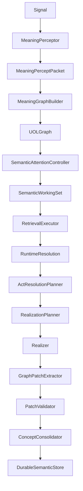

# Semantic Graph Brain Design

Status: target architecture design
Audience: CEMM implementers, reviewers, and future coding agents
Scope: semantic kernel/runtime redesign to make the UOL graph brain authoritative

## 1. Executive Summary

CEMM should become a semantic graph brain: a runtime where text is only one
input/output surface, and the active computation happens over UOL graph state,
candidate interpretation paths, operational ports, selected evidence, causal
affordances, and graph patch learning.

The current implementation has strong pieces of this design, especially
`MeaningPerceptor`, `MeaningGraphBuilder`, `UOLGraph`, `ActResolutionPlanner`,
`GraphPatchExtractor`, `ConceptConsolidator`, and persistent lattice storage.
The main problem is architectural authority: the newer UOL path is not yet the
only path that controls runtime behavior and durable learning.

The breakthrough design is to make one object authoritative:

```text
SemanticKernelRuntime
```

It owns the full cycle:

```text
Observe
-> Contextualize
-> Interpret
-> Ground
-> Retrieve
-> Infer
-> Decide
-> Realize
-> Update
-> Learn
```

No downstream module may use raw text as its primary semantic input after
`MeaningPerceptor`. Raw text remains evidence, never the control surface.

## 2. Design Thesis

CEMM should behave less like a chatbot pipeline and more like a semantic CPU.

The semantic CPU has:

- instructions: user signals, system signals, memory updates, tool results
- registers: active context, self state, active topic, working focus, budget
- memory: concept lattice, construction lattice, predicate schemas, source
  policies, causal affordances, episodic exemplars, patch journal
- operators: retrieve, bind, resolve, infer, ask, answer, remember, abstain,
  act, reflect, quarantine
- scheduler: semantic attention controller
- write barrier: graph patch validator and consolidator

The CPU does not execute English strings. It executes graph state.

## 3. Non-Negotiable Runtime Invariants

1. `Signal` must exist before perception.
2. `MeaningPerceptPacket` must exist before graph construction.
3. `UOLGraph` must exist before retrieval, inference, planning, realization,
   patch extraction, or learning.
4. Candidate meanings must remain observable until a selector records selected
   and rejected paths.
5. Durable learning must only happen through accepted `GraphPatch` objects.
6. Direct durable writes from perception, retrieval, operators, or raw text are
   invalid.
7. Permission, source, evidence, freshness, contradiction, risk, and temporal
   scope must be evaluated before consolidation.
8. Realization must be traceable to a plan, graph state, selected evidence,
   and realization contract.
9. Legacy structures may exist only as adapters derived from UOL graph state.
   They must not be independent behavioral authorities.

## 4. Target Runtime Shape



The key difference from the current hybrid pipeline is that `UOLGraph` is the
single semantic workbench. `SemanticEventGraph`, `ConversationActPacket`, and
legacy UOL mapper outputs may be exported for compatibility, but they cannot
override the semantic graph path.

## 5. Canonical Runtime Object

Add:

```text
cemm/kernel/semantic_kernel_runtime.py
```

Primary API:

```python
class SemanticKernelRuntime:
    def run_turn(self, signal: Signal, kernel: ContextKernel) -> RuntimeCycleResult:
        ...
```

`RuntimeCycleResult` is the canonical trace container:

```python
@dataclass
class RuntimeCycleResult:
    signal: Signal
    context_kernel: ContextKernel
    percept: MeaningPerceptPacket
    uol_graph: UOLGraph
    working_set: SemanticWorkingSet
    retrieval: RetrievalExecutionResult
    resolution: RuntimeResolutionResult
    act_plan: ActResolutionPlan
    realization_plan: RealizationPlan
    answer_graph: SemanticAnswerGraph | None
    realized_output: str
    patch_candidates: list[GraphPatch]
    validation: PatchValidationResult
    consolidation: ConsolidationResult
    diagnostics: RuntimeDiagnostics
```

This object should replace scattered trace fragments. Every test should be able
to assert stage order and inspect intermediate graph state.

## 6. Semantic Attention Controller

The missing "brain" piece is not another classifier. It is a graph attention
controller.

Add:

```text
cemm/kernel/semantic_attention_controller.py
cemm/types/semantic_focus.py
cemm/kernel/semantic_working_set.py
```

The controller loops over graph structures under budget:

```text
initial focus =
    active intent atoms
  + unresolved candidate sets
  + required but unbound ports
  + fresh evidence requirements
  + contradiction markers
  + safety/risk atoms
  + self/action affordance atoms

while budget remains:
    select highest-value focus item
    resolve candidate path or port
    retrieve evidence if required
    infer affordance or causal consequence
    record selected/rejected paths
    stop when action-ready, ask-needed, abstain-needed, or budget exhausted
```

The controller output:

```python
@dataclass
class SemanticWorkingSet:
    focus_items: list[SemanticFocus]
    selected_paths: list[InterpretationPath]
    rejected_paths: list[RejectedInterpretationPath]
    unresolved_ports: list[str]
    evidence_requirements: list[EvidenceRequirement]
    candidate_actions: list[CandidateAction]
    retrieval_targets: list[RetrievalTarget]
    inference_targets: list[InferenceTarget]
    risk_flags: list[RiskFlag]
    confidence: float
```

The working set is the bridge between graph construction and planning. It is
where CEMM becomes more than deterministic routing.

## 7. Runtime Resolution

Runtime resolution is a named stage between `UOLGraph` and planning.

It includes:

- concept resolution
- construction matching
- operational-port binding
- candidate-set selection/rejection
- source/evidence requirement detection
- affordance prediction
- causal lookup
- self/action capability lookup
- contradiction and freshness checks

Add:

```text
cemm/kernel/runtime_resolution.py
```

Output:

```python
@dataclass
class RuntimeResolutionResult:
    concept_resolutions: list[ConceptResolution]
    construction_matches: list[ConstructionMatch]
    port_bindings: list[PortBinding]
    affordance_predictions: list[AffordancePrediction]
    selected_paths: list[InterpretationPath]
    rejected_paths: list[RejectedInterpretationPath]
    evidence_requirements: list[EvidenceRequirement]
    retrieval_plan: RetrievalPlan
    confidence: float
```

`ActResolutionPlanner` should consume this result, not re-derive everything
from conversation acts or raw text.

## 8. Durable Semantic Store

Durable memory must store compressed semantic structures, not raw runtime
artifacts as the primary memory.

Add or consolidate behind:

```text
cemm/memory/durable_semantic_store.py
```

Canonical durable records:

- concept atoms
- aliases
- parent links
- operational ports
- predicate schemas
- construction records
- causal affordances
- source policies
- claim records materialized from accepted patches
- patch journal entries
- validation events
- sparse high-value exemplars

`Store.claims.put(...)` may continue to exist internally, but callers should not
write claims directly. Claims are materialized by `DurableSemanticStore` after
patch validation.

## 9. Graph Patch Learning Contract

Learning path:

```text
UOLGraph
-> GraphPatch candidates
-> PatchValidator
-> accepted/quarantined/rejected result
-> ConceptConsolidator / DurableSemanticStore
```

Patch operations should include:

```text
upsert_concept_candidate
upsert_relation_candidate
upsert_claim_candidate
upsert_predicate_schema
upsert_construction_record
observe_port_binding
upsert_affordance_candidate
update_source_policy
retain_exemplar
quarantine_candidate
```

The `RememberOperator` must not write claims. It should return or execute a
graph-patch write request.

## 10. Patch Validator

Add:

```text
cemm/learning/patch_validator.py
```

Validation dimensions:

- permission validity
- source trust
- source freshness
- contradiction against active durable records
- temporal containment
- required port completeness
- evidence coverage
- confidence
- risk
- cost
- promotion threshold

Validation result:

```python
@dataclass
class PatchValidationResult:
    accepted: list[GraphPatch]
    rejected: list[RejectedPatch]
    quarantined: list[QuarantinedPatch]
    needs_confirmation: list[GraphPatch]
    needs_retrieval: list[GraphPatch]
    diagnostics: list[ValidationDiagnostic]
```

Low confidence is not rejection by default. It can route to quarantine, ask, or
retrieve.

## 11. Self Model

Self must be graph-native, not just JSON state plus seed claims.

Add:

```text
cemm/memory/self_model_lattice.py
```

Self records:

- identity
- capabilities
- limitations
- active operators
- allowed actions
- blocked actions
- required permissions
- required evidence classes
- known failure modes
- uncertainty causes
- confidence builders
- confidence reducers
- active learning goals
- source policies

Self should answer:

```text
What am I?
What can I do?
What can I not do?
What do I know?
What do I need to know better?
What evidence do I require?
What actions are available?
What actions are unsafe or unavailable?
What changes my confidence?
What recent failures should affect this turn?
```

Represent these as concept, predicate, port, affordance, and policy records.
Do not bury them in realization templates.

## 12. Legacy Compatibility Boundary

Legacy structures are allowed only behind adapters:

```text
UOLGraph -> SemanticEventGraphAdapter
UOLGraph -> ConversationActAdapter
UOLGraph -> TrainingExportAdapter
UOLGraph -> LegacyTraceAdapter
```

Invalid:

```text
raw text -> DecisionRouter
ConversationAct -> final action without UOLGraph
SemanticEventGraph -> direct durable learning
RememberOperator -> Store.claims.put
```

Valid:

```text
UOLGraph -> adapter -> old consumer
old consumer output -> diagnostic only
```

## 13. Realization Design

Realization should be driven by:

- `ActResolutionPlan`
- selected evidence
- `SemanticWorkingSet`
- answer graph or realization plan
- verification policy

Add:

```text
cemm/synthesis/realization_plan.py
```

Realization strategy order:

```text
template
-> extractive
-> constrained neural
-> ask
-> abstain
```

The realizer must never invent unsupported factual spans. Any unsupported span
must be either removed, framed as uncertainty, or cause abstention.

## 14. Acceptance Criteria

The design is implemented only when these are true:

1. A turn cannot reach decision without `UOLGraph`.
2. A turn cannot write durable memory without accepted `GraphPatch`.
3. `RememberOperator` no longer calls `Store.claims.put` directly.
4. `DecisionRouter` no longer uses raw-text heuristics as primary authority.
5. `SemanticCPU` or `SemanticKernelRuntime` is the single runtime entrypoint.
6. Candidate sets expose selected and rejected paths in traces.
7. Retrieval is planned from graph focus and evidence requirements.
8. Self answers come from self semantic records, not hardcoded templates alone.
9. Fresh-world queries route to retrieve, ask, or abstain by policy.
10. Contradictory patches are quarantined or require confirmation.
11. Tests prove that direct perception/retrieval cannot write durable facts.
12. Tests prove that old SEG/ConversationAct adapters cannot override UOLGraph.

## 15. Strategic Summary

The target is not more clever routing. The target is a semantic operating
kernel.

The graph brain becomes real when:

```text
UOLGraph is the working memory,
SemanticAttentionController is the scheduler,
ActResolutionPlanner is the decision compiler,
GraphPatchValidator is the write barrier,
and DurableSemanticStore is the learned semantic substrate.
```

