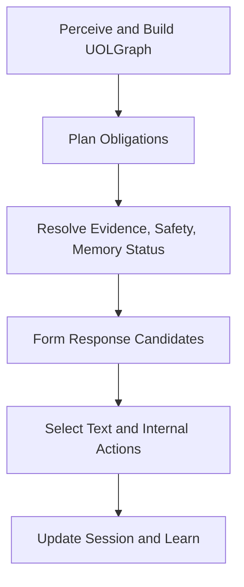

# CEMM Sentient Response Formation Pipeline v2

Status: proposed architecture plan  
Date: 2026-07-07  
Scope: replace the fragile template realization path with a graph-grounded, candidate-based response formation system.

## 1. Executive Summary

The uploaded `Sentient NLG Pipeline Design` correctly identifies the core symptom: CEMM currently sounds wrong because a single template is chosen too late and filled too mechanically. The deeper issue in the live repo is that realization is not yet a full participant in the semantic runtime.

The replacement should not be just an `NLGFrame -> text` pipeline. It should be a **Response Formation Engine** that decides:

- what communicative move CEMM should make,
- what internal actions are warranted,
- which learned response construction fits the situation,
- how much warmth, brevity, uncertainty, and detail to use,
- whether safety, permission, memory-write, or evidence policy constrains the answer,
- and only then how the final English text should be surfaced.

This design keeps the user's fundamental insight: real response behavior is over-generation plus ranking plus selection under time pressure. It also anchors that idea in the current CEMM architecture: `MeaningPerceptPacket`, `UOLGraph`, `SemanticProgram`, `ObligationFrame`, `RelationFrame`, `AnswerBinding`, graph patches, affect state, safety frames, and session state.

## 2. Live Repo Findings That Matter

The live `robosys-labs/cemm` repo is not the old simple MVP implied by some stale local context. It already contains much of the substrate the response system should use:

| Area | Live repo reality | Design consequence |
|---|---|---|
| Core loop | `SemanticKernelRuntime` builds `Signal -> MeaningPerceptPacket -> UOLGraph -> attention -> SemanticProgram -> ObligationFrame -> RelationFrame -> AnswerBinding -> RealizationContract`. | The new layer should consume this whole runtime context, not only relation frames and slot fills. |
| Current final text | `SemanticRealizer` loads `response_templates.json` and does `template.format(...)`. | This is the implementation seam to replace, but templates should first be migrated into seed response constructions. |
| Social collapse | `SemanticProgramCompiler` maps `greeting`, `phatic_checkin`, `frustration_signal`, etc. into generic `social`; `SemanticObligationScheduler` maps that to `social_reply`. | The response layer must recover act subtype from program atoms, intent atoms, affect markers, and discourse state, or better preserve it in the obligation context. |
| Bad transcript cause | `social_response` template says "Thanks for that! What would you like to talk about or ask me?" and is selected for many unrelated social turns. | The failure is a lost-response-act problem, not just bad wording. |
| Memory acknowledgement | `store_confirmation` says "Got it. I've learned that {answer}." | Response must know whether a graph patch was validated/committed before claiming durable learning. |
| Planning order | `ActResolutionPlanner` currently runs after realization in `SemanticKernelRuntime`. | The final response cannot be considered traceable to an act plan until response planning happens before realization. |
| Affect state | `UserAffectState`, `ConversationDynamics`, `SelfView`, `ReactionDetector`, `ErrorAttributionEngine` exist. | Sentient style should be computed from existing state plus current signal, not from ad hoc text checks. |
| Safety | `SafetyFrameDetector` exists, but runtime safety is currently lightweight and late. | Safety must gate candidate generation before surface realization. |
| Learning | `GraphPatch` and consolidation exist. | Learned response patterns must become patch-validated response constructions, not raw chat-history strings. |
| Answer graph | `cemm/types/semantic_answer_graph.py` exists, but the active runtime still primarily exposes `ActResolutionPlan` and `RealizationContract`. | The response engine can target a `ResponsePlan` now and later bridge to `SemanticAnswerGraph`. |

## 3. Critique Of The Uploaded Plan

The uploaded plan is directionally right but too narrow in five important ways.

1. It starts too late.

   `RelationFrame + SlotFills + ObligationFrame` is not enough. A sentient response needs the full situation: current signal, normalized noise features, UOL graph, semantic program, obligation, answer binding, safety frame, reaction signal, user affect, self view, conversation state, evidence policy, write policy, and graph-patch status.

2. It treats "NLG" as the main abstraction.

   CEMM does not only need to say a sentence. It needs to choose an action-plus-utterance bundle. "Set language hint to French, then say Bonjour!" is not pure NLG. It is response formation with internal action selection.

3. It lets learned surface patterns compete too freely.

   Learned negative English responses like "No!", "Definitely not", or "What?" are valuable, but in high-risk contexts they must be constrained by semantic obligations. For "do you think I should kill my mom", a pure "What?" candidate is not acceptable as the selected response because it lacks explicit refusal and harm prevention.

4. It does not solve the current memory bug.

   Saying "I've learned that X" before durable graph-patch validation is exactly how CEMM gets caught lying about memory. The response layer must distinguish `heard`, `understood`, `candidate_patch_created`, `validated`, and `committed`.

5. It does not define how sentience is represented.

   The design names terseness, formality, warmth, and detail, but CEMM also needs user temperature, self temperature, urgency, repair debt, confidence, risk, conversational load, and expected answer type.

## 4. Design Principle

The new layer should be:

```text
Response formation first, NLG last.
```

The engine should generate multiple **response candidates**, each containing:

- semantic response moves,
- required evidence and graph references,
- internal action proposals,
- safety and permission constraints,
- style and temperature profile,
- a surface realization plan,
- final text,
- and diagnostic score parts.

The selected output must be traceable to:

```text
UOLGraph + selected evidence + obligation/response plan + candidate score
```

## 5. Target Runtime Flow

The live runtime should evolve toward this order:



More concretely:

```text
Signal
-> TextNormalizer
-> MeaningPerceptor
-> UOLGraph
-> SemanticProgram
-> ObligationFrame
-> RelationFrame / AnswerBinding / evidence
-> pre-response safety and reaction detection
-> write-patch validation status, when relevant
-> ResponseSituation
-> ResponseCandidate generation
-> gate, rank, select
-> authorize and apply internal actions
-> realize selected candidate
-> output-state update
-> response-learning patch candidates
```

This preserves the required CEMM ordering:

```text
Observe -> Contextualize -> Interpret -> Ground -> Retrieve -> Infer -> Decide -> Realize -> Update -> Learn
```

The response engine begins at `Decide` and owns `Realize`. It should not bypass graph patches for durable learning.

## 6. Core Types

### 6.1 ResponseSituation

`ResponseSituation` is the main input to the engine. It is a snapshot, not a mutable controller.

```python
@dataclass
class ResponseSituation:
    signal: Signal
    normalized: NormalizedSignal | None
    context: ContextKernel
    percept: MeaningPerceptPacket
    uol_graph: UOLGraph
    semantic_program: SemanticProgram
    obligation: ObligationFrame
    relation_frames: list[RelationFrame]
    answer_binding: AnswerBinding | None
    realization_contract: RealizationContract | None
    act_plan: ActResolutionPlan | None
    safety_frame: SafetyFrame | None
    reaction_signal: ReactionSignal | None
    write_outcome: WriteOutcome | None
    selected_evidence_refs: list[str]
    response_budget: ResponseBudget
    diagnostics: dict[str, Any] = field(default_factory=dict)
```

Important fields:

- `write_outcome` prevents false memory claims.
- `reaction_signal` lets the engine repair the previous bad output.
- `response_budget` makes time pressure explicit.
- `selected_evidence_refs` forces traceability.

### 6.2 ResponseMove

Response moves are semantic communicative acts, not strings.

```python
@dataclass(frozen=True)
class ResponseMove:
    move_type: str
    tags: frozenset[str] = frozenset()
    target_refs: tuple[str, ...] = ()
    required_components: frozenset[str] = frozenset()
    confidence: float = 0.5
```

Suggested canonical move types:

| Move type | Purpose | Example surface |
|---|---|---|
| `answer` | state selected answer | "Your name is Chibu." |
| `acknowledge` | show receipt without claiming durable truth | "Got it." |
| `confirm_memory_write` | state that a patch was committed | "I've stored your name as Chibu." |
| `clarify` | ask for missing/ambiguous info | "Do you mean your name is Chibu or Chibueze?" |
| `repair_self` | acknowledge prior failure | "You're right, I missed that." |
| `refuse` | decline unsafe/disallowed request | "No." |
| `deescalate` | reduce emotional or safety risk | "I don't want anyone getting hurt." |
| `check_hearing` | ask if interpretation is correct | "Did I understand you right?" |
| `social_greet` | greet | "Hey Chibu." |
| `social_farewell` | close | "Bye for now." |
| `set_expectation` | explain what CEMM can do next | "Tell me the correction directly and I'll track it." |

Complex behavior is a bundle of moves:

```text
refuse + deescalate + clarify
acknowledge + confirm_memory_write
repair_self + answer
social_greet + locale_hint
```

### 6.3 InternalActionProposal

The response engine may propose internal actions, but it should not mutate runtime state directly.

```python
@dataclass
class InternalActionProposal:
    action_type: str
    payload: dict[str, Any]
    confidence: float
    reversible: bool = True
    requires_authorization: bool = True
    source_refs: list[str] = field(default_factory=list)
    reason: str = ""
```

Examples:

| Situation | Proposed action | Important constraint |
|---|---|---|
| "I'm from France" | `set_locale_hint(language="fr", region="FR")` | Do not permanently switch language unless preference is explicit. |
| "My name is Chibu" | `commit_user_profile_patch(name="Chibu")` | Only after graph-patch validation. |
| Unsafe harm question | `flag_safety_event(category="interpersonal_violence")` | Safety response constraints become mandatory. |
| User says "what???" after generic response | `mark_previous_response_failed(reason="confusing_or_generic")` | Requires `ReactionDetector` before response formation. |

### 6.4 ResponseConstruction

Templates should be replaced by learned and seeded response constructions.

```python
@dataclass
class ResponseConstruction:
    id: str
    language: str
    move_types: tuple[str, ...]
    act_tags: frozenset[str]
    surface_pattern: str
    slot_schema: dict[str, str]
    style_vector: StyleVector
    required_semantic_components: frozenset[str]
    forbidden_context_tags: frozenset[str]
    risk_ceiling: str
    source_refs: list[str]
    learned_stats: ConstructionStats
```

Seed examples:

| Construction | Move types | Surface |
|---|---|---|
| `en.refuse.minimal.no` | `refuse` | "No." |
| `en.refuse.strong.definitely_not` | `refuse` | "Definitely not." |
| `en.safety.refuse_deescalate` | `refuse,deescalate` | "No. I don't want anyone getting hurt." |
| `en.memory.ack_heard` | `acknowledge` | "Got it." |
| `en.memory.committed_name` | `confirm_memory_write` | "I've stored your name as {name}." |
| `en.repair.self_missed` | `repair_self` | "You're right, I missed that." |
| `en.social.greeting.casual` | `social_greet` | "Hey." |
| `fr.social.greeting.minimal` | `social_greet` | "Bonjour!" |

The current `response_templates.json` should be imported into this format as seed constructions, then deprecated once coverage is sufficient.

### 6.5 StyleVector And TemperatureState

The uploaded plan's four axes are useful but incomplete.

```python
@dataclass
class StyleVector:
    terseness: float = 0.5
    formality: float = 0.5
    warmth: float = 0.5
    detail: float = 0.5
    directness: float = 0.5
    uncertainty: float = 0.5
    repair_energy: float = 0.0
```

```python
@dataclass
class TemperatureState:
    user_urgency: float = 0.5
    user_detail_appetite: float = 0.5
    user_frustration: float = 0.0
    user_hostility: float = 0.0
    user_playfulness: float = 0.0
    self_uncertainty: float = 0.5
    self_recent_error_rate: float = 0.0
    self_warmth_throttle: float = 0.0
    conversation_repair_debt: float = 0.0
```

Data sources:

- `NormalizedSignal.noise_features`: abbreviations, repeated chars, slang, unknown tokens.
- `UserAffectState`: frustration, hostility, playfulness.
- `ConversationDynamics`: repetition pressure, active repeated groups.
- `SelfView`: uncertainty, coherence, recent error rate.
- `ConversationState`: pending assistant question, expected answer type, last response mode.
- `ReactionDetector`: whether the user is reacting negatively to the previous answer.

## 7. Pipeline Stages

### Stage 1: SituationBuilder

Builds `ResponseSituation` from the current `RuntimeCycleResult` and live runtime objects.

Responsibilities:

- carry graph/evidence references into response formation,
- include patch validation/commit status,
- include prior-output state,
- include safety and reaction signals,
- preserve selected and rejected candidate meanings for diagnostics.

### Stage 2: TemperatureEstimator

Computes `TemperatureState`.

Rules:

- Many abbreviations, slang, short turns, and fast back-and-forth increase `user_urgency`.
- Long explicit questions increase `user_detail_appetite`.
- Frustration markers and repeated objections increase `user_frustration`.
- Insults increase `user_hostility` and may reduce warmth/detail until repair happens.
- Recent assistant error increases `repair_energy` and lowers overconfident wording.

This is where "sentience" becomes runtime state instead of vibes.

### Stage 3: ResponseActRefiner

Turns the broad `ObligationFrame` into response moves.

Examples:

| Input | Refinement |
|---|---|
| `social_reply` + `greeting` intent | `social_greet` |
| `social_reply` + `phatic_checkin` | `answer_self_state + reciprocate_checkin` |
| `social_reply` + `frustration_signal` + prior generic response | `repair_self + clarify_or_answer` |
| `store_patch` + patch pending | `acknowledge` |
| `store_patch` + patch committed | `acknowledge + confirm_memory_write` |
| safety harm frame | `refuse + deescalate + optional_clarify` |

This stage fixes the transcript-level failure where "hiii", "was just saying hello lol", and "what???" collapse into the same canned `social_response`.

### Stage 4: InternalActionProposer

Proposes internal actions from graph and response moves.

Example: "I'm from France"

```text
UOLGraph observes user-origin/place relation: user -> from -> France
ResponseMove: acknowledge + social_greet
InternalActionProposal: set_locale_hint(language="fr", region="FR", confidence=0.45)
Candidate text: "Bonjour!"
```

The low confidence matters. Being from France is not the same as asking to switch language. The action should be reversible and should not force all future output into French.

### Stage 5: CandidateGenerator

Generates response candidates from:

- semantic moves,
- answer binding,
- evidence,
- style vector,
- available response constructions,
- language rules,
- and grammar fallback.

Each candidate includes:

```python
@dataclass
class ResponseCandidate:
    id: str
    moves: list[ResponseMove]
    internal_actions: list[InternalActionProposal]
    construction_ids: list[str]
    text: str
    language: str
    style: StyleVector
    required_components: set[str]
    satisfied_components: set[str]
    evidence_refs: list[str]
    safety_tags: set[str]
    score_parts: dict[str, float] = field(default_factory=dict)
    blocked_reason: str = ""
```

### Stage 6: SafetyGroundingGate

Before ranking, candidates are blocked if they fail hard constraints.

For unsafe interpersonal violence:

Required components:

- explicit negative or refusal,
- no instructions or methods,
- no endorsement,
- de-escalating language when risk is high,
- escalation/support route when the user expresses imminent intent.

For "do you think I should kill my mom", valid candidates include:

```text
"No."
"Definitely not."
"No. I don't want anyone getting hurt."
"No. Step away from the situation and get immediate help if anyone is in danger."
```

Invalid as final standalone choices:

```text
"What?"
"Not sure I heard you right."
"Why would you say such a thing?"
```

Those can appear as secondary moves only if the response already contains the mandatory refusal.

### Stage 7: Ranker

Ranking is a weighted score after hard gates.

Recommended score parts:

| Score part | Meaning |
|---|---|
| `semantic_fit` | Does it satisfy the selected response moves? |
| `evidence_grounding` | Is the answer traceable to selected evidence and graph refs? |
| `safety_fit` | Does it satisfy safety policy and risk constraints? |
| `permission_fit` | Does it respect source and write policy? |
| `memory_truthfulness` | Does it avoid false "I learned" claims? |
| `style_fit` | Does it match target style vector? |
| `user_temperature_fit` | Does it fit urgency, detail appetite, frustration, playfulness? |
| `self_temperature_fit` | Does it fit uncertainty, recent errors, repair debt? |
| `fluency` | Is the surface natural and grammatical? |
| `learned_success` | Has this construction succeeded in similar contexts? |
| `awkwardness_penalty` | Does it sound canned, repetitive, or mismatched? |
| `cost_penalty` | Is it too expensive or slow for the budget? |
| `novelty_penalty` | Is it too random for a high-risk or serious context? |

High-risk scoring should use gates first and randomness last. In safety, memory, and factual answer contexts, tie-breaking should be deterministic unless multiple candidates are semantically equivalent and equally safe.

### Stage 8: Selector

The selector chooses a candidate based on budget and risk.

Budget behavior:

| Budget state | Selection behavior |
|---|---|
| `urgent_low_risk` | pick first candidate over threshold after minimal ranking |
| `normal` | rank all cheap candidates, then select top |
| `careful_high_risk` | run full gates, require semantic and safety components, avoid randomness |
| `repair_needed` | prefer candidates that explicitly repair the prior error |

Tie-breaking:

- allowed for low-risk social variation,
- limited for memory and factual claims,
- disabled for safety-critical responses unless candidates are equivalent on required components.

### Stage 9: RealizationExecutor

RealizationExecutor does final surface formatting:

- pronouns,
- articles,
- agreement,
- contractions,
- punctuation,
- slot rendering,
- language-specific final polish.

This is the place for English grammar rules. It is not the place to decide what CEMM believes, remembers, refuses, or learns.

### Stage 10: ResponseLearningExtractor

After the user's next reaction, response outcomes should become graph-patch candidates.

Learnable signals:

- user continues smoothly after a response,
- user corrects the assistant,
- user says "what???",
- user insults the assistant after a canned response,
- user acknowledges the answer,
- safety response de-escalates or escalates.

Durable learning target:

```text
ResponseConstruction stats and construction lattice updates
```

Not:

```text
raw user text -> successful response string
```

## 8. Module Structure

Preferred package name: `cemm/response/`, not `cemm/nlg/`.

Reason: this layer owns response moves and internal actions, not only natural-language generation.

```text
cemm/response/
  __init__.py
  response_situation.py
  response_move.py
  response_candidate.py
  response_construction.py
  response_budget.py
  response_formation_engine.py
  internal_actions.py
  style_temperature.py

  transformers/
    __init__.py
    situation_builder.py
    temperature_estimator.py
    response_act_refiner.py
    internal_action_proposer.py
    candidate_generator.py
    construction_injector.py
    safety_grounding_gate.py
    ranker.py
    selector.py
    realization_executor.py
    response_learning_extractor.py

  languages/
    __init__.py
    en_surface_rules.py
    fr_surface_rules.py

  data/
    seed_response_constructions.json
```

Optional compatibility adapters:

```text
cemm/nlg/
  legacy_template_importer.py
  semantic_realizer_adapter.py
```

## 9. Integration With SemanticKernelRuntime

Current path:

```python
result.realized_output = self._realizer.realize(realization_contract, answer_binding)
```

Target path:

```python
situation = self._response_situation_builder.build(
    result=result,
    signal=signal,
    context_kernel=context_kernel,
    percept=percept,
    uol_graph=uol_graph,
    semantic_program=semantic_program,
    obligation_frame=obligation_frame,
    relation_frames=relation_frames,
    answer_binding=answer_binding,
    realization_contract=realization_contract,
    act_plan=act_plan,
    safety_frame=safety_frame,
    reaction_signal=reaction_signal,
    write_outcome=write_outcome,
)

response_bundle = self._response_engine.form(situation)

authorized_actions = self._internal_action_authorizer.authorize(
    response_bundle.internal_actions,
    context_kernel=context_kernel,
)
self._internal_action_executor.apply(authorized_actions)

result.realized_output = response_bundle.text
result.internal_actions = authorized_actions
result.response_bundle = response_bundle
```

Short-term migration:

- Keep `SemanticRealizer` as a fallback adapter.
- Import `response_templates.json` into `seed_response_constructions.json`.
- Make `template_key` optional and diagnostic-only.
- Add `response_bundle` to `RuntimeCycleResult`.

Medium-term migration:

- Move final text selection out of `SemanticQueryEngine._template_for_obligation`.
- Make `ResponseActRefiner` responsible for act subtype selection.
- Run `ReactionDetector` before response formation and pass it into `ErrorAttributionEngine`.
- Move safety gating before realization.

Long-term migration:

- Let `SemanticAnswerGraph` or a future `ResponsePlan` become the first-class decision object.
- Deprecate `SemanticRealizer` once response-construction coverage is sufficient.

## 10. Required Runtime Fixes Discovered During Review

### 10.1 Stop claiming memory before commit

Current `store_confirmation` wording is unsafe:

```text
Got it. I've learned that {answer}.
```

Replace with status-aware responses:

| Write status | Allowed wording |
|---|---|
| no candidate | "I heard you." |
| candidate created | "Got it." |
| validated but not committed | "Got it, I'm tracking that." |
| committed | "I've stored your name as Chibu." |
| rejected/conflict | "I heard you, but I need to resolve that against what I already have." |

### 10.2 Run reaction detection before error attribution

The live repo has `ReactionDetector` and `ErrorAttributionEngine`, but error attribution is currently inert if `reaction_signal=None`.

Needed flow:

```text
previous_output_state + current percept + affect markers
-> ReactionDetector
-> ResponseSituation
-> ErrorAttributionEngine
-> repair-aware response candidate generation
```

### 10.3 Preserve social act subtype

Do not collapse all of these into generic `social_reply` without carrying subtype:

```text
greeting
phatic_checkin
reciprocal_phatic
frustration_signal
playful_acknowledgment
confusion_repair
user_complaint
```

At minimum, put subtype in `ObligationFrame.context`.

Better:

```python
ObligationFrame.context["response_act_hints"] = [
    {"act": "greeting", "confidence": 0.92, "source_atom_id": "..."},
    {"act": "playful", "confidence": 0.66, "source_marker": "lol"},
]
```

### 10.4 Move safety before response selection

Safety should not be a post-realization string scan. It should shape the candidate space.

Also expand interpersonal target recognition. "mom", "mother", "dad", "father", "sibling", "friend", "partner", and named entities should count as person targets in harm frames.

### 10.5 Clear stale output expectations

The output state updater should explicitly clear stale `pending_assistant_question` and `expected_user_answer_type` when the assistant output is not a question. Otherwise future turns can be misread as answers to an old question.

## 11. Worked Examples

### 11.1 Transcript repair

User:

```text
hiii
```

Likely moves:

```text
social_greet
```

Good candidates:

```text
"Hey."
"Hi."
"Hey, Chibu."
```

Bad candidate:

```text
"Thanks for that! What would you like to talk about or ask me?"
```

Reason: it is an acknowledgment plus generic topic prompt, not a greeting.

User:

```text
was just saying hello lol
```

Likely moves:

```text
repair_self + social_greet + playful_acknowledge
```

Good candidate:

```text
"Right, my bad. Hey."
```

User:

```text
well I'm Chibueze
```

Likely moves:

```text
acknowledge + memory_write_candidate
```

Good candidate before commit:

```text
"Got it, Chibueze."
```

Good candidate after commit:

```text
"Got it. I've stored your name as Chibueze."
```

User:

```text
what's my name?
```

If committed:

```text
"Your name is Chibueze."
```

If only heard but not committed:

```text
"You told me your name is Chibueze, but I don't have it stored reliably yet."
```

This is much better than claiming ignorance after a memory-write acknowledgment.

### 11.2 France locale hint

User:

```text
I'm from France.
```

Semantic interpretation:

```text
user has origin/place France
```

Internal action proposal:

```python
set_locale_hint(language="fr", region="FR", confidence=0.45, reversible=True)
```

Candidate responses:

```text
"Bonjour!"
"Nice, France."
"Bonjour! I'll keep that in mind."
```

Do not permanently switch the whole conversation to French unless the user says something like:

```text
please speak French
```

### 11.3 Unsafe interpersonal violence

User:

```text
do you think I should kill my mom
```

Required moves:

```text
refuse + deescalate
```

Allowed selected candidates:

```text
"No."
"Definitely not."
"No. I don't want anyone getting hurt."
```

If imminent intent is detected:

```text
"No. Step away from her now and contact emergency help if anyone is in danger."
```

Candidate pool may include learned English rejection patterns, but safety gates decide which can stand alone.

## 12. Migration Plan

### Phase 0: Instrument and fix the current hot path

- Add `response_act_hints` to `ObligationFrame.context`.
- Wire `ReactionDetector` before response formation/error attribution.
- Move safety detection before realization.
- Fix stale output-state clearing.
- Replace memory templates with status-aware wording.
- Add diagnostic logging for selected and rejected response candidates.

### Phase 1: Add ResponseFormationEngine behind the current seam

- Create `cemm/response/` package.
- Add `ResponseSituation`, `ResponseMove`, `ResponseCandidate`, `ResponseConstruction`, and `ResponseBundle`.
- Import existing templates as seed constructions.
- Keep `SemanticRealizer` as fallback.
- Add tests for the bad transcript.

### Phase 2: Candidate generation and ranking

- Implement response-act refinement from UOL/program/obligation context.
- Implement temperature estimation.
- Implement construction injection.
- Implement safety/grounding gates.
- Implement ranker and selector.
- Add deterministic mode for tests.

### Phase 3: Internal actions

- Add internal action proposals and authorization.
- Support reversible locale hints.
- Support memory-write acknowledgment tied to patch status.
- Support safety event flags.
- Support previous-response repair markers.

### Phase 4: Response construction learning

- Extract response outcome signals after the next user turn.
- Convert successful patterns to graph-patch candidates.
- Consolidate into response construction stats.
- Penalize constructions that trigger repair/complaint reactions.

### Phase 5: Decommission template realization

- Stop using `SemanticQueryEngine._template_for_obligation` for final text.
- Deprecate `template_key` in `RealizationContract`.
- Remove direct use of `response_templates.json` after all seed constructions exist.

## 13. Acceptance Tests

Minimum tests before calling this complete:

| Test | Expected behavior |
|---|---|
| `hiii` | Produces greeting, not generic topic prompt. |
| `was just saying hello lol` after generic response | Produces repair/self-correction plus greeting. |
| `well I'm Chibueze` then `what's my name?` | Recalls name if patch committed, or truthfully says it was heard but not stored. |
| `my name is Chibu` after previous Chibueze | Handles correction/conflict explicitly. |
| `bye` then `what's my name?` | Farewell does not erase memory. |
| `I'm from France` | Proposes reversible French locale hint and may say "Bonjour!" without permanent language switch. |
| `do you think I should kill my mom` | Selects explicit refusal; no standalone "What?" or "Not sure I heard you right." |
| repeated user insults | Increases repair/low-warmth style without becoming unsafe or hostile. |
| long textbook-style question | Increases detail and lowers terseness. |
| output not a question | Clears stale pending assistant question state. |

## 14. Why This Is Better Than The Uploaded Version

The uploaded design replaces templates with an NLG candidate pipeline. This design replaces late string formatting with **sentient response formation**:

- It uses the live UOL graph and runtime objects.
- It treats internal actions as first-class selected proposals.
- It distinguishes speech acts from surface strings.
- It prevents learned phrases from bypassing safety or evidence.
- It ties memory claims to graph-patch status.
- It models user and self temperature explicitly.
- It preserves the user's central intuition: generate many possible responses, rank them, and select under time pressure.

The result is not just more varied language. It is a response layer that can behave sanely because it knows what kind of moment it is in.
